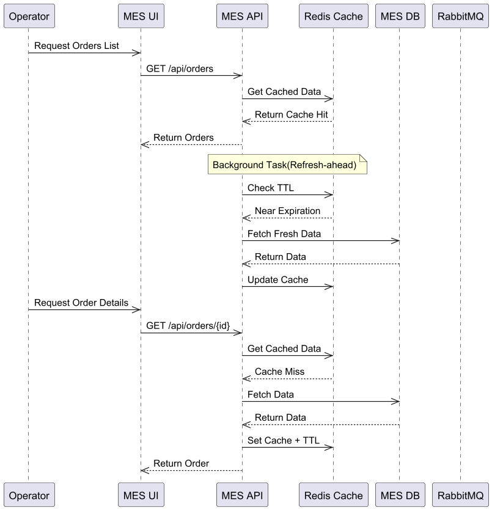

### Архитектурное решение по кешированию

#### Мотивация
Сейчас операторы жалуются на низкую скорость работы страницы, а клиенты — на медленную обработку заказов. Это связано с увеличением нагрузки на систему и отсутствием оптимизации часто используемых операций, таких как получение списка заказов и обновление их статусов. Внедрение кеширования позволит:
1. Уменьшить время отклика для операторов и клиентов.
2. Снизить нагрузку на базу данных и API.
3. Ускорить обработку часто выполняемых операций, таких как чтение списка заказов.

Частями системы, которые наиболее подходят для кеширования, являются:
- **Список заказов** — часто запрашивается операторами и редко изменяется.
- **Информация о статусах заказов** — требует быстрого доступа и обновляется при конкретных действиях.

#### Предлагаемое решение
Мы предлагаем внедрить **серверное кеширование** для повышения производительности и надежности системы.

##### Тип кеширования
Мы выбрали **серверное кеширование**, так как оно:
- Позволяет централизованно управлять кешем.
- Подходит для сценариев с высокой нагрузкой на базу данных.
- Устраняет необходимость обновления данных на каждом клиенте.

##### Паттерны кеширования
Общий выбранный паттерн: **Cache-Aside**.
- **Почему Cache-Aside**: Этот паттерн удобен, когда данные читаются чаще, чем обновляются. При запросе данных система сначала проверяет кеш, и только в случае отсутствия обращается к базе данных.
- **Почему не Write-Through**: Write-Through увеличивает задержку при записи, что может быть критично для быстрого обновления статусов заказов.
- **Почему не Refresh-Ahead**: Refresh-Ahead сложнее в реализации и требует точной настройки для прогнозирования изменений.
Для MES Frontend использовать паттерн **Refresh-ahead**.
- так как Кэширование Refresh-ahead — это метод, при котором данные заранее загружаются в кэш до того, как они будут запрашиваться. 
Это ускоряет доступ к часто запрашиваемой информации, снижает нагрузку на сервер и уменьшает время отклика, особенно для статичных или предсказуемых данных.

##### Диаграмма последовательности действий
**Процесс чтения списка заказов:**
1. Клиент (оператор) запрашивает список заказов.
2. Система проверяет наличие данных в кеше:
   - Если данные найдены, возвращает их клиенту
   - Если данных нет, запрашивает из базы данных
3. Система асинхронно обновляет кеш для следующих запросов и возвращает результат клиенту

**Процесс изменения статуса заказа:**
1. Клиент (оператор) отправляет запрос на изменение статуса.
2. API обновляет статус в базе данных.
3. Запись в кеше инвалидируется.

##### Стратегия инвалидации кеша
Мы используем **инвалидацию по ключу**, так как:
- Она проста в реализации и подходит для сценариев с локализованными изменениями данных.
- Для данных с высокой частотой обновлений этот метод обеспечивает согласованность.

**Почему не временная инвалидация**:
- Необходимость высокой актуальности данных делает этот метод менее подходящим.
**Почему не программная инвалидация**:
- Усложняет код и увеличивает вероятность ошибок.

#### Сравнительный анализ стратегий

| Стратегия              | Плюсы                                    | Минусы                                   |
|------------------------|------------------------------------------|------------------------------------------|
| Инвалидация по ключу   | Простая и быстрая.                      | Требует точного отслеживания ключей.    |
| Временная инвалидация  | Минимизирует нагрузку на базу.          | Возможны устаревшие данные.             |
| Программная инвалидация| Гибкость.                               | Увеличивает сложность реализации.       |

#### Заключение
Рекомендуем использовать **серверное кеширование с паттерном Cache-Aside** и стратегией инвалидации по ключу.
Это решение обеспечивает оптимальное сочетание производительности и согласованности данных.